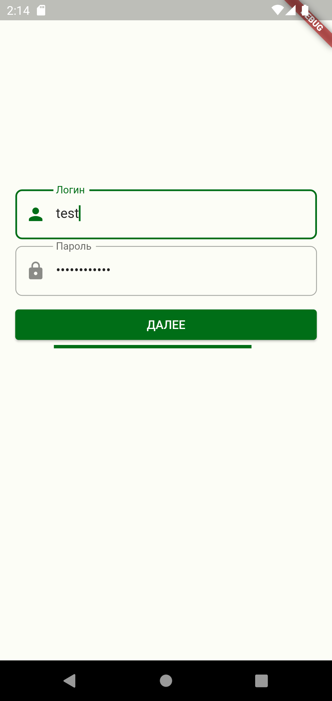
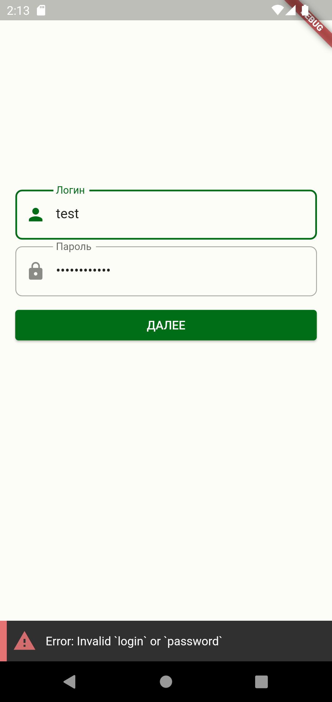
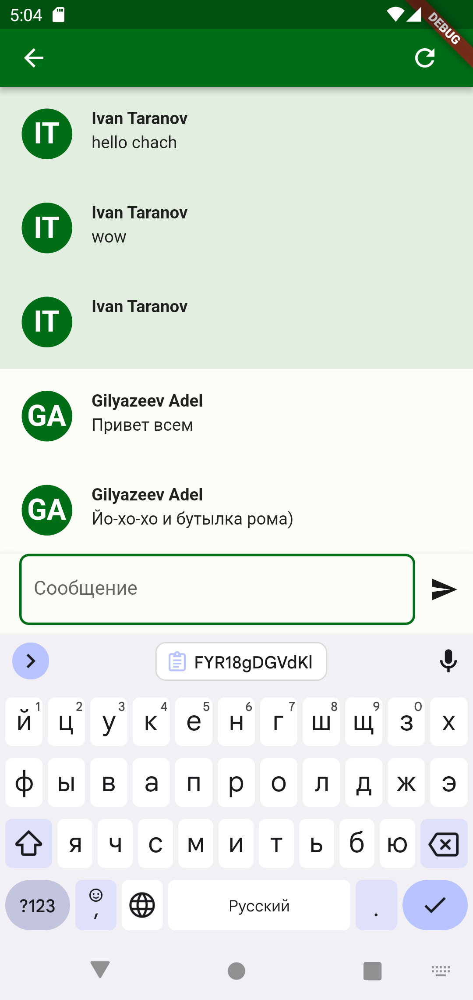

# Flutter Study Jam 2

## Требования к приложению

- Версия Flutter: **3.0.5**
- Версия Dart: **2.17.1**

Ваша ветка с выполнением задания должна называться `study-jam-2/day-1`.

В шаблонном приложении у вас уже есть базовая реализация чата. Но, чтобы получить доступ к чату, для начала нужно авторизоваться.

Эмоджи 🔥 показывает задание повышеной сложности.

# День 1

## Авторизация

### Как получить аккаунт? 

1. Перейдите на [сайт авторизации](https://study-jam.surfstudio.ru/#/signin).
2. Нажмите на кнопку "Sign in with Github"
3. Дайте нужные права приложению
4. Для вас сгенерируется уникальные логин и пароль. Сохраните их обязательно!

Эти логин и пароль вы сможете использовать для реализации экрана авторизации.

### Задание 1. Интерфейс

Реализовать пользовательский интерфейс экрана авторизации.

### Задание 2. Логика

Нужно реализовать логику авторизации.

Для реализации экрана вам доступен класс `IAuthRepository`. В нём уже реализована базовая работа с сервером и обработка ошибок (вносить изменения в класс не запрещается). Его метод `signIn` принимает данные пользователя:

- `login` - ваш email, который вы присылали для регистрации
- `password` - пароль, который пришёл вам на email

При успешной авторизации вы получите токен, который потребуется для других запросов. Его нужно сохранить в постоянной памяти. Вы можете использовать любое удобное вам хранилище (мы в Surf часто используем [shared_preferences](https://pub.dev/packages/shared_preferences)).

При успешном сохранении токена, вы сможете воспользоваться методом `pushToChat` для перехода на экран чата (`ChatScreen`).

### Задание 3. Снекбар

Реализовать отображение SnackBar при ошибке.

## Чат. Рефакторинг

Для вас этот экран покажется знакомым, если вы участвовали в нашем первом Study Jam в феврале. Вам не нужно реализовывать экран во второй раз. Вместо этого вам нужно будет доработать уже существующий экран.

### Задание 1. Сообщение геолокации

Помимо обычных сообщений типа `ChatMessageDto`, вам может встретиться его наследник `ChatMessageGeolocationDto`.

Реализуйте отображение такого сообщения в пользовательском интерфейсе.

### Задание 2. Открытие карты с геолокацией 🔥

По нажатию на кнопку "Открыть на карте" должно открываться одно из приложений карт, доступных на устройстве. Это может быть любое первое попавшееся приложение.

### Задание 3. Отправка геолокации 🔥

Также вы можете сами отправить сообщение с геолокацией, передав эту модель `ChatMessageGeolocationDto` в метод `IChatRepository.sendMessage`.

Конечно же отправлять нужно настоящую геолокацию! Вы можете сделать, например, с помощью пакета [geolocator](https://pub.dev/packages/geolocator).

### Задание 4. Отображение изображения

Помимо геолокации у вас есть и другие виды сообщений. Например, изображение. Для этого вы можете сделать модель `ChatMessageImageDto`, и параметр `imageUrl`, в котором будеть содержаться ссылка на фотографию.

### Задание 5. Отправка изображения 🔥

Как и в случае с геолокацией, вам нужно уметь отправлять сообщения. Для этого вы также можете воспользоваться методом `IChatRepository.sendMessage` и отправить туда сообщение типа `SendMessageImageDto`, которое понимает в себя параметр типа `File`.

### Задание 6. Аватарки 🔥

Сейчас все аватарки у пользователей одинаковые и скучные :(

Сделайте так, чтобы у аватарки каждого пользователя в чате был свой уникальный цвет. Например, аватарка Пети Сидорова должна отображаться как "ПС" в центре аватара и иметь розовый цвет на всех сообщениях в чате. При перезапуске приложения или установке его на другое устройство у Пети Сидорова должен быть тот же самый уникальный цвет, а у Васи Иванова - свой.

### Задание 7. Баблы

Добавьте отображение сообщений в чате в виде баблов, как во всех популярных мессенджерах.

### Креатив 🔥🔥🔥

Успели сделать все задания раньше всех или просто хотите выделиться? Доработайте чат по своему усмотрению!

Метод `sendMessage` помимо прочего принимает параметр `payload` типа `Playload`. Этот метод нужен для того, чтобы вы могли добавить к сообщению любые данные, которые захотите.

