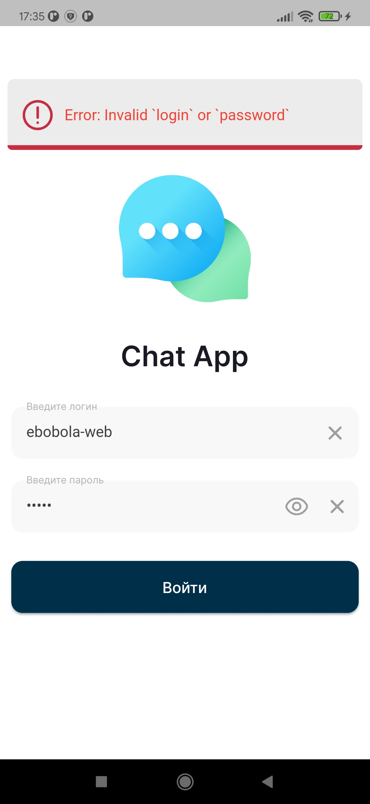

# *Не закончено*

# Surf Study Jam **Chat App** by *ebobola-web*

# Что необходимо было сделать

#### День 1

- Реализовать пользовательский интерфейс экрана авторизации
- Нужно реализовать логику авторизации
- Реализовать отображение SnackBar при ошибке
- Доработать уже существующий экран чата
- Реализовать отображение сообщения с геолокацией
- Реализовать открытие карты с геолокацией
- Реализовать отправку сообщения с геолокацией
- Реализовать отображение изображений в сообщении
- Реализовать отправку сообщения с изображениями
- Сделать так, чтобы у аватарки каждого пользователя в чате был свой уникальный цвет
- Добавить отображение сообщений в чате в виде баблов

#### День 2
- Реализовать пользовательский интерфейс для экрана топиков
- Добавить отображение моего реального имени пользователя в AppBar экрана
- Реализовать отображение списка топиков на экране
- Изменить навигацию так, чтобы после успешной авторизации показывался именно экран Списка топиков, а не базовый чат
- Реализовать отображение сообщения с геолокацией
- Реализовать пользовательский интерфейс для экрана Создания топиков
- Реализовать создание нового топика

#### Что я не сделал
- Нет возможности отправить локальное изображение

#### Что сделано не так, как написано в задании
- Вместо цветных аватарок пользователей, я сделал обычные аватарки, которые у них уже имеются
- Геолокацию можно отправить только свою, нет возможности выбрать точку и поделиться её координатами (не знаю, нужно ли было это вообще)
- На экране чата в аппбаре я написал название чата, вместо своего имени, у меня его всё равно нет)

#### _Всё остальное выполнено по заданию_

# Как работает приложение

### Авторизация

||
:-------------------------:|:-------------------------:|:-------------------------:
На главном экране кнопка войти будет недоступна, пока хотя бы одно из полей пусто  |  Пароль скрыт по умолчанию, его можно посмотреть нажав на глазик в поле ввода пароля (Глазик виден, только когда поле не пусто)  |  В процессе выполнения авторизации выезжает заблюренный баннер с бегунком загрузки

*При успешной авторизации, токен будет сохранён в secureStorage, при следущем запуске приложения авторизация выполнится автоматически (конечно если токен не инвалид к тому времени), токен удаляется из secureStorage при выходе из аккаунта

### Чаты (Экран с чатами)
|
:-------------------------:|:-------------------------:
Список чатов(топиков) можно обновить нажав на иконку в правом верхнем углу  |   Нажав на плюсик в левом верхнем углу, открывается диалоговое окно, в котором можно создать новый чат

- Нажав на чат из списка откроется экран с сообщениями этого чата
- В нижнем правом углу экрана находится кнопка выхода из аккаунта, после выхода из аккаунта, мы попадём на первый экран - экран авторизации, а также приложение забудет токен

### Чат (Экран чата)

|
:-------------------------:|:-------------------------:
Обновить сообщения можно с помощью кнопки в правом верхнем углу экрана (при открытии обновляется само)  |  Сообщение может содержать в себе сразу и текст, и изображения, и геолокацию

|
:-------------------------:|:-------------------------:
Если в сообщении несколько картинок, то сверху справа у изображения будет бадж с количеством изображений (на карточке сообщения показывается только первое фото)  |  Когда в сообщении несколько изображений, можно нажать на фото, чтобы открыть диалоговое окно для просмотра всех прикрепленных изображений

- Класс сообщений изменен, убраны деления на сообщения с геолокацией и картинками, как и в функциях отправки сообщений в репозитории, вместо этого базовый класс сообщения теперь может содержать в себе и изображения, и геолокацию
- Если сообщение содержит геолокацию, сверху карточки будет кнопка прикреплена локация, нажав на кнопку, можно посмотреть локацию на карте
- Также сообщения автоматически прокручиваются вниз при обновлении, и при нажатии на кнопку в правом нижнем углу (кнопка видна при скролле вниз, и будет скрыта при скролле вверх, старался сделать, как в телеграмме, вышло чуть криво)

- Мои сообщения распологаются справа

 

- Есть возможность прикрепить свою гелокацию, а также изображения с интернета (ссылки)
- После прикрепления геолокации, её можно открепить (удалить), до отправки сообщения
- После прикрепления изображений, можно удалить только сразу все изображения

# О приложении, моём подходе и возникших трудностях
 **[Дизайн](https://symu.co/freebies/mobile-apps/nearby-free-figma-mobile-app-template/)** для приложения был взят с сайта **[symu.co](https://symu.co/freebies/mobile-apps)**
  Все иконки, используемые в приложении были взяты с сайта **[Flaticon](https://www.flaticon.com)**

 В архитектурных подходах я пока не силён, в качестве стейт-менеджмента во всех своих пет проектах использую Bloc, как и тут, не всё что можно было, разбил на блоки, торопился, гнался больше за тем, чтобы успеть выполнить все задачи, чем за красотой и нормальной декомпозицией кода. А ещё код не закоментирован практически...

 ### Немного о "фичах"
 - Переходы по страницам анимированы
 - Появление диалоговых окон анимировано
 - Анимированы некоторые элементы интерфейса, такие как:
	 - Кнопки отчистки текстого поля ввода (присутствуют на всех инпутах), появляются <ins>плавно</ins>, когда поле ввода не пусто
	 - Кнопка глазика, которая переключает видимость пароля
	 - Индикатор обновления чатов и сообщений (в правом верхнем углу) плавно меняется на кнопку обновления
	 - Баннер авторизации также выдвигается и уходит плавно (из-за быстрого запроса это только хуже смотрится...)
	 - Анимированный заблюренный снек-бар 

Вообще я люблю анимации

### Что я бы сделал (добавил / доработал), будь у меня больше времени
- Функционал удаления определённого изображения из прикрепленных
- Отправку локальных изображений, скорее всего я бы делал это с помощью **[strapi](https://strapi.io)**, так как с ним у меня был небольшой опыт
- Больше блоков, как минимум, из ChatState вынес бы messageFieldText и прикрепленные сообщения с геолокацией в отдельный блок, почистил бы большинство стейтфул виджетов и вынес их состояние в блок
- Больше анимаций при первом открытии экрана (например, выдвигающиеся из-за краёв экрана элементы интерфейса)
- И в последнюю очередь, скорее всего, возможность отвечать на сообщения (пересылать)

### Про трудности
Практически любая возникшая у меня проблема в коде решалась либо первым гуглением, либо я просто сам тормозил и быстро осознавал это. Я не сталкивался с сильными проблемами, которые могли задержать меня надолго, возможно поэтому в чате у меня была очень маленькая активность
